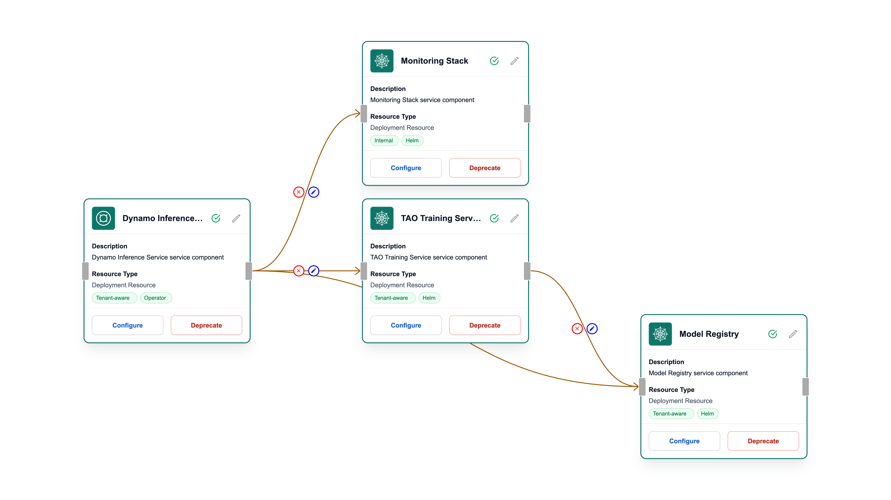
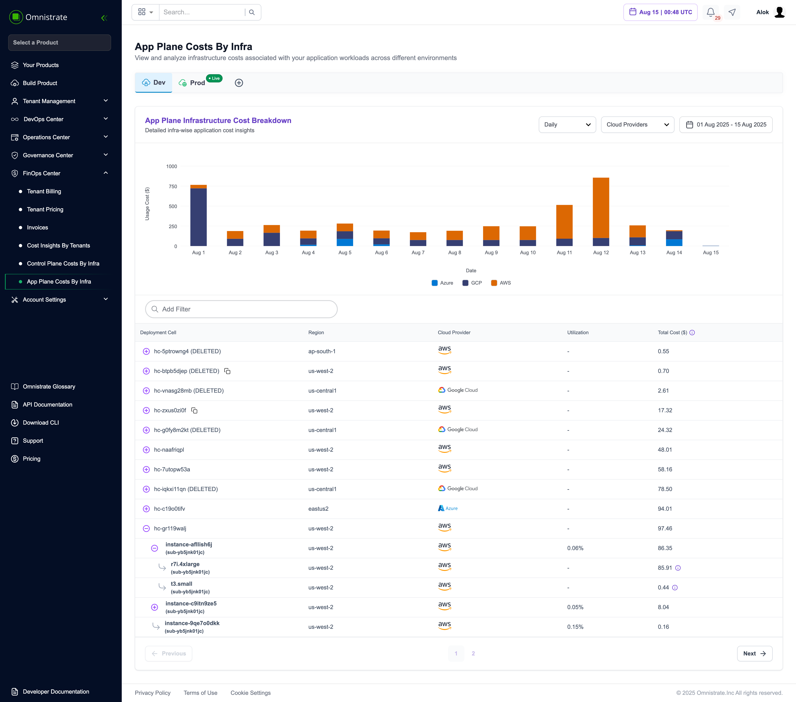

# NVIDIA AI Multi-Cloud Pipeline on Omnistrate

## Overview

This is a comprehensive example of an enterprise-grade NVIDIA AI/ML platform specification for Omnistrate, designed to showcase how easily AI companies can deploy production-ready machine learning infrastructure. The example demonstrates the complete bundling of NVIDIA's open-source ecosystem, from data ingestion to model training to high-performance inference, all deployed seamlessly across multiple cloud providers.

**Omnistrate ❤️ NVIDIA OSS** - This specification leverages the full power of NVIDIA's open-source AI stack, demonstrating how Omnistrate can "print" complete AI/ML platforms with enterprise-grade reliability and multi-cloud portability.

## Architecture



```
┌─────────────────────────────────────────────────────────────────────────────────────────┐
│                        NVIDIA AI Multi-Cloud Pipeline                                   │
│                          Powered by Omnistrate Platform                                 │
└─────────────────────────────────────────────────────────────────────────────────────────┘

┌─────────────────────────┐    ┌─────────────────────────┐    ┌─────────────────────────┐
│          AWS            │    │          GCP            │    │        Azure            │
│                         │    │                         │    │                         │
│  ┌───────────────────┐  │    │  ┌───────────────────┐  │    │  ┌───────────────────┐  │
│  │    AI Gateway     │  │    │  │    AI Gateway     │  │    │  │    AI Gateway     │  │
│  │   (Load Balancer) │  │    │  │   (Load Balancer) │  │    │  │   (Load Balancer) │  │
│  └─────────┬─────────┘  │    │  └─────────┬─────────┘  │    │  └─────────┬─────────┘  │
│            │            │    │            │            │    │            │            │
│  ┌─────────▼─────────┐  │    │  ┌─────────▼─────────┐  │    │  ┌─────────▼─────────┐  │
│  │ NVIDIA Dynamo     │  │    │  │ NVIDIA Dynamo     │  │    │  │ NVIDIA Dynamo     │  │
│  │ Inference Service │  │    │  │ Inference Service │  │    │  │ Inference Service │  │
│  │ ┌───────────────┐ │  │    │  │ ┌───────────────┐ │  │    │  │ ┌───────────────┐ │  │
│  │ │ T4 GPU Pods   │ │  │    │  │ │ T4 GPU Pods   │ │  │    │  │ │ T4 GPU Pods   │ │  │
│  │ │ Auto-scaling  │ │  │    │  │ │ Auto-scaling  │ │  │    │  │ │ Auto-scaling  │ │  │
│  │ │ KV Cache      │ │  │    │  │ │ KV Cache      │ │  │    │  │ │ KV Cache      │ │  │
│  │ └───────────────┘ │  │    │  │ └───────────────┘ │  │    │  │ └───────────────┘ │  │
│  └─────────┬─────────┘  │    │  └─────────┬─────────┘  │    │  └─────────┬─────────┘  │
│            │            │    │            │            │    │            │            │
│  ┌─────────▼─────────┐  │    │  ┌─────────▼─────────┐  │    │  ┌─────────▼─────────┐  │
│  │ NVIDIA TAO        │  │    │  │ NVIDIA TAO        │  │    │  │ NVIDIA TAO        │  │
│  │ Training Service  │  │    │  │ Training Service  │  │    │  │ Training Service  │  │
│  │ ┌───────────────┐ │  │    │  │ ┌───────────────┐ │  │    │  │ ┌───────────────┐ │  │
│  │ │ T4 GPU Nodes  │ │  │    │  │ │ T4 GPU Nodes  │ │  │    │  │ │ T4 GPU Nodes  │ │  │
│  │ │ Jupyter Labs  │ │  │    │  │ │ Jupyter Labs  │ │  │    │  │ │ Jupyter Labs  │ │  │
│  │ │ TensorBoard   │ │  │    │  │ │ TensorBoard   │ │  │    │  │ │ TensorBoard   │ │  │
│  │ │ Distributed   │ │  │    │  │ │ Distributed   │ │  │    │  │ │ Distributed   │ │  │
│  │ └───────────────┘ │  │    │  │ └───────────────┘ │  │    │  │ └───────────────┘ │  │
│  └─────────┬─────────┘  │    │  └─────────┬─────────┘  │    │  └─────────┬─────────┘  │
│            │            │    │            │            │    │            │            │
│  ┌─────────▼─────────┐  │    │  ┌─────────▼─────────┐  │    │  ┌─────────▼─────────┐  │
│  │ Model Registry    │  │    │  │ Model Registry    │  │    │  │ Model Registry    │  │
│  │ (MinIO S3 API)    │  │    │  │ (MinIO S3 API)    │  │    │  │ (MinIO S3 API)    │  │
│  │ ┌───────────────┐ │  │    │  │ ┌───────────────┐ │  │    │  │ ┌───────────────┐ │  │
│  │ │ Models Bucket │ │  │    │  │ │ Models Bucket │ │  │    │  │ │ Models Bucket │ │  │
│  │ │Datasets Bucket│ │  │    │  │ │Datasets Bucket│ │  │    │  │ │Datasets Bucket│ │  │
│  │ │Checkpoint Bkt │ │  │    │  │ │Checkpoint Bkt │ │  │    │  │ │Checkpoint Bkt │ │  │
│  │ │ Versioning    │ │  │    │  │ │ Versioning    │ │  │    │  │ │ Versioning    │ │  │
│  │ └───────────────┘ │  │    │  │ └───────────────┘ │  │    │  │ └───────────────┘ │  │
│  └─────────┬─────────┘  │    │  └─────────┬─────────┘  │    │  └─────────┬─────────┘  │
│            │            │    │            │            │    │            │            │
│  ┌─────────▼─────────┐  │    │  ┌─────────▼─────────┐  │    │  ┌─────────▼─────────┐  │
│  │   Monitoring      │  │    │  │   Monitoring      │  │    │  │   Monitoring      │  │
│  │ (Prometheus +     │  │    │  │ (Prometheus +     │  │    │  │ (Prometheus +     │  │
│  │  Grafana Stack)   │  │    │  │  Grafana Stack)   │  │    │  │  Grafana Stack)   │  │
│  │ ┌───────────────-┐│  │    │  │ ┌───────────────-┐│  │    │  │ ┌───────────────-┐│  │
│  │ │ GPU Metrics    ││  │    │  │ │ GPU Metrics    ││  │    │  │ │ GPU Metrics    ││  │
│  │ │Training Metrics││  │    │  │ │Training Metrics││  │    │  │ │Training Metrics││  │
│  │ │Inference Perf  ││  │    │  │ │Inference Perf  ││  │    │  │ │Inference Perf  ││  │
│  │ │ Cost Analytics ││  │    │  │ │ Cost Analytics ││  │    │  │ │ Cost Analytics ││  │
│  │ └───────────────-┘│  │    │  │ └───────────────-┘│  │    │  │ └───────────────-┘│  │
│  └───────────────────┘  │    │  └───────────────────┘  │    │  └───────────────────┘  │
└─────────────────────────┘    └─────────────────────────┘    └─────────────────────────┘

┌────────────────────────────────────────────────────────────────────────────────────────-─┐
│                               NVIDIA OSS Ecosystem                                       │
│                                                                                          │
│  ┌─────────────┐    ┌─────────────-┐    ┌─────────────┐    ┌─────────────┐               │
│  │ TAO Toolkit │    │   Dynamo     │    │   MinIO     │    │ Prometheus  │               │
│  │   (OSS)     │    │    (OSS)     │    │  (OSS S3)   │    │   (OSS)     │               │
│  │ TensorFlow  │    │ TensorRT-LLM │    │ Model Store │    │ Monitoring  │               │
│  │   PyTorch   │    │ Disaggregated│    │ Versioning  │    │ & Alerting  │               │
│  └─────────────┘    └─────────────-┘    └─────────────┘    └─────────────┘               │
└──────────────────────────────────────────────────────────────────────────────────────-───┘
```


## Getting Started: Deploy Your AI Platform in Minutes

### 1. Prerequisites
Go to https://omnistrate.cloud to get started with Omnistrate.
```bash
# Just need an Omnistrate account - no cloud expertise required!
- Omnistrate account with cloud providers connected
- Basic understanding of AI/ML workflows
- Your datasets and model requirements
```

### 2. Setup the Platform Control Plane
Follow https://ctl.omnistrate.cloud/install/ to install the Omnistrate CLI
```bash
omctl build -f spec.yaml --name 'NVIDIA Platform' --spec-type ServicePlanSpec --release-as-preferred
```

### 3. Use the auto-generated Self-Service Portal to deploy your AI/ML platform


## 🏗️ Build AI/ML Pipelines as Platforms: Control Plane as a Service

### The Platform Builder's Dream

Omnistrate transforms AI/ML teams from infrastructure operators into **platform builders**. Whether you're building internal ML platforms for your data science teams or external AI-as-a-Service offerings for customers, Omnistrate provides the foundation to create production-ready platforms with enterprise-grade tenant isolation.


## Omnistrate Cellular Architecture for AI/ML

### Overview

Omnistrate's cellular architecture provides the perfect foundation for AI/ML workloads, offering isolation, scalability, and multi-tenancy that AI companies need to serve diverse customers and use cases.

### AI/ML Cell Types

#### **Research & Development Cells**
- Shared infrastructure for experimentation
- Cost-optimized for iterative development
- Quick provisioning for new projects
- Jupyter-first development environment

#### **Production Training Cells**
- Dedicated GPU resources for large model training
- High-performance storage for large datasets
- Distributed training across multiple nodes
- Automatic checkpointing and model versioning

#### **Inference Serving Cells**
- Auto-scaling inference endpoints
- Low-latency serving for real-time applications
- Multi-model serving capabilities
- A/B testing and canary deployments

#### **Enterprise AI Cells**
- Compliance-ready for regulated industries
- Private cloud deployment options
- Custom security and governance policies
- Dedicated support and SLAs

### Sample AI/ML Deployment Strategy

```
Global AI Platform Deployment:

Research & Development:
├── US-West-2 (AWS) - Shared Research Cell
│   ├── Jupyter-based experimentation
│   ├── Small-scale training jobs
│   └── Proof-of-concept development
├── EU-West-1 (GCP) - Shared Research Cell
│   ├── European data residency
│   ├── GDPR-compliant experimentation
│   └── Multi-language model research

Production Training:
├── US-East-1 (AWS) - Dedicated Training Cell
│   ├── Large language model training
│   ├── Multi-GPU distributed training
│   └── High-performance storage
├── Asia-Pacific-1 (GCP) - Regional Training Cell
│   ├── Regional model customization
│   ├── Local dataset processing
│   └── Reduced data transfer costs

Inference Serving:
├── Global (Multi-Cloud) - Auto-scaling Inference
│   ├── Low-latency model serving
│   ├── Geographic load balancing
│   ├── A/B testing capabilities
│   └── Cost-optimized inference

Enterprise:
├── Customer Private Clouds - Enterprise Cells
│   ├── BYOC deployment model
│   ├── Customer-specific compliance
│   ├── Private model repositories
│   └── Custom SLA requirements
```


### 🚀 **Infrastructure & Resource Management: Fully Managed**

**What Omnistrate Handles (So You Don't Have To):**

#### **Infrastructure Layer**
- Kubernetes cluster provisioning and management
- GPU node pool scaling and optimization
- Cloud provider resource orchestration
- Network security and VPC configuration
- Storage provisioning and backup management

#### **Platform Layer**
- Service mesh and ingress configuration
- Certificate management and SSL termination
- Load balancing and traffic routing
- Monitoring and alerting infrastructure
- Logging aggregation and retention

#### **Operational Layer**
- Automated updates and security patches
- Disaster recovery and business continuity
- Cost optimization and resource rightsizing
- Compliance and audit trail management
- 24/7 platform health monitoring

### 🏢 **External Customers: AI-as-a-Service Made Simple**

Build customer-facing AI platforms without the operational overhead:

```yaml
SaaS AI Platform Architecture:
├── Customer Onboarding
│   ├── Self-service tenant provisioning
│   ├── Automated resource allocation
│   ├── Custom billing and metering
│   └── White-label customer portals
│
├── Tenant Management
│   ├── Per-customer resource isolation
│   ├── Custom compute and storage limits
│   ├── Independent scaling policies
│   └── Isolated model repositories
│
└── Platform Operations
    ├── Centralized monitoring across tenants
    ├── Unified billing and cost allocation
    ├── Global load balancing and routing
    └── Cross-tenant analytics and insights
```

**Real-World Example:**
```bash
# Deploy AI platform for 100+ external customers
omctl build -f spec.yaml --name 'NVIDIA Platform' --spec-type ServicePlanSpec --release-as-preferred
  
# Result: Production-ready AI SaaS in minutes
# - Automatic customer onboarding
# - Per-customer resource isolation  
# - Usage-based billing integration
# - Enterprise-grade security
```

### 🏬 **Internal Customers: Enterprise ML Platform**

Transform your organization's AI/ML capabilities:

```yaml
Enterprise ML Platform:
├── Data Science Teams
│   ├── Self-service Jupyter environments
│   ├── Collaborative model development
│   ├── Experiment tracking and versioning
│   └── Dataset discovery and lineage
│
├── ML Engineering Teams  
│   ├── Model deployment pipelines
│   ├── A/B testing infrastructure
│   ├── Model monitoring and drift detection
│   └── Production inference serving
│
├── Business Units
│   ├── Department-specific AI services
│   ├── Custom model fine-tuning
│   ├── Private dataset management
│   └── Compliance-specific deployments
│
└── Executive Dashboard
    ├── AI adoption metrics
    ├── Cost allocation by department
    ├── ROI tracking and analysis
    └── Governance and compliance reports
```

## NVIDIA Open Source Stack Integration

### 🏗️ TAO Toolkit (Transfer Learning Toolkit)
```yaml
# Enterprise-grade training with NVIDIA's OSS stack
TAO Training Service:
  - NVIDIA TAO Toolkit with TensorFlow
  - Jupyter notebook environment for interactive development
  - TensorBoard for experiment tracking and visualization
  - Distributed training across multiple T4 GPUs
  - Automatic model checkpointing and versioning
```

### ⚡ Dynamo Inference Engine
```yaml
# High-performance inference with NVIDIA's OSS optimization
Dynamo Inference Service:
  - NVIDIA Dynamo with TensorRT-LLM optimization
  - Disaggregated serving architecture for scalability
  - KV cache for improved LLM inference performance
  - Auto-scaling based on request load
  - Multi-replica deployment for high availability
```

### 📦 MinIO Model Registry
```yaml
# S3-compatible storage built on OSS foundations
Model Registry:
  - MinIO open-source object storage
  - S3-compatible API for seamless integration
  - Automatic bucket organization (models, datasets, checkpoints)
  - Built-in versioning and lifecycle management
  - Cross-cloud replication capabilities
```

### 📊 Prometheus + Grafana Monitoring
```yaml
# Comprehensive observability with OSS tools
Monitoring Stack:
  - Prometheus for metrics collection and alerting
  - Grafana for visualization and dashboards
  - Custom NVIDIA AI dashboards for training and inference
  - GPU utilization tracking and optimization insights through the Omnistrate platform
  - Cost analytics and resource optimization through the Omnistrate platform
```




## Multi-Cloud Layered Configuration

Omnistrate's layered chart values provide seamless multi-cloud deployment:

### Base Layer (All Clouds)
- NVIDIA container configurations
- GPU resource requests and limits
- Common security policies
- Standard scaling configurations

### AWS-Specific Layer
- G4dn instances with T4 GPUs
- EBS GP3 storage optimization
- ALB ingress with SSL termination
- AWS EFA for high-performance networking

### GCP-Specific Layer  
- N2 instances with T4 GPU acceleration
- SSD persistent disk optimization
- Cloud Load Balancer integration
- Google Cloud VPC native networking

### Azure-Specific Layer
- NC4as_T4_v3 instances with T4 GPUs
- Managed disk storage optimization
- Azure Load Balancer integration
- Azure CNI for optimal networking

## The Omnistrate Advantage: Printing AI/ML Platforms

### 🎨 From Complex to Simple
**Traditional AI Infrastructure Deployment:**
```bash
# Months of work, dozens of engineers
1. Provision cloud infrastructure
2. Set up Kubernetes clusters  
3. Configure GPU node pools
4. Install NVIDIA drivers and container runtime
5. Deploy and configure each service individually
6. Set up monitoring and alerting
7. Configure networking and security
8. Set up CI/CD pipelines
9. Set up disaster recovery
```

**Omnistrate AI Platform Deployment:**
```bash
# Minutes of work, zero infrastructure expertise
omctl build -f spec.yaml --name 'NVIDIA Platform' --spec-type ServicePlanSpec --release-as-preferred
```


## The Future is Multi-Cloud AI

With Omnistrate, you're not just deploying AI infrastructure – you're **printing complete AI platforms** that can run anywhere, scale infinitely, and adapt to any requirement. Whether you're a startup training your first model or an enterprise serving millions of inference requests, Omnistrate makes it as simple as defining what you want and letting the platform handle the rest.

---

*Ready to print your AI platform? Get started with Omnistrate today and join the companies who've discovered that the future of AI infrastructure is declarative, multi-cloud, and surprisingly simple.*